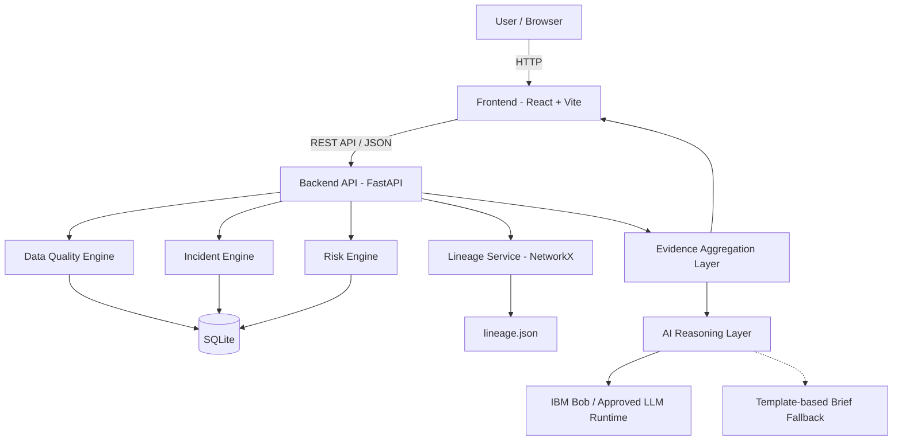

# Architecture

## System Architecture

DataSentinel AI uses a modular web architecture designed to detect data-quality incidents, investigate their likely upstream source, determine downstream impact, prioritize severity, and generate an evidence-based investigation brief.

The application follows a frontend–backend architecture with a Python-based analytical layer and a lineage graph. Quantitative evidence is generated by deterministic/statistical processing, while the AI reasoning layer converts the structured evidence into a human-readable investigation brief and remediation guidance.

## Components

| Component                  | Technology                              | Responsibility                                                                                                                                                                       |
| -------------------------- | --------------------------------------- | ------------------------------------------------------------------------------------------------------------------------------------------------------------------------------------ |
| Frontend                   | React + Vite                            | Dashboard, incident investigation interface, lineage visualization, blast-radius visualization, and AI investigation interface                                                       |
| Backend API                | Python + FastAPI                        | REST API, request validation, orchestration, service coordination, and error handling                                                                                                |
| Data Quality Engine        | Python + Pandas                         | Calculates data-quality metrics and detects null spikes, duplicate spikes, schema changes, and distribution drift                                                                    |
| Incident Engine            | Python                                  | Converts detected anomalies into structured incident records containing type, dataset, timestamp, magnitude, and evidence                                                            |
| Lineage Service            | NetworkX + `lineage.json`               | Represents data dependencies, identifies upstream candidates, and calculates downstream blast radius                                                                                 |
| Risk Engine                | Python                                  | Calculates transparent incident severity using anomaly magnitude, affected records, criticality, downstream impact, duration, and source confidence                                  |
| Evidence Aggregation Layer | Python                                  | Combines detector results, timeline events, lineage information, schema history, risk scores, and recommended actions into one structured evidence object                            |
| AI Reasoning Layer         | IBM Bob / approved LLM runtime          | Converts structured evidence into plain-language explanations, investigation summaries, and prioritized remediation guidance; runtime Bob capability requires organizer verification |
| Fallback Brief Generator   | Python templates                        | Generates a deterministic incident brief when the AI reasoning layer is unavailable                                                                                                  |
| Database                   | SQLite                                  | Stores incidents, metrics, severity scores, and related application state                                                                                                            |
| Lineage Data               | JSON                                    | Stores the prototype data-flow dependency graph                                                                                                                                      |
| Visualization              | Plotly / React visualization components | Displays trends, incident metrics, dependency graphs, and impact paths                                                                                                               |
| Version Control            | Git + GitHub                            | Source-code management and required hackathon submission repository                                                                                                                  |

## Data Flow

DataSentinel AI processes information through the following end-to-end flow:

1.Data ingestion
Synthetic enterprise datasets such as customers.csv, orders.csv, payments.csv, and products.csv are loaded into the application.

2.Quality metric calculation
The Data Quality Engine calculates metrics such as null rate, duplicate rate, schema state, and distribution characteristics.

3.Incident detection
The calculated metrics are compared against historical or baseline values using rules and statistical techniques. When a significant deviation is detected, an incident record is created.

4.Incident classification
The incident is classified into one of the supported categories:
    -Null spike
    -Duplicate spike
    -Schema change
    -Distribution drift

5.Timeline correlation
The system compares the incident's first-seen timestamp with pipeline execution logs and schema-history events to reconstruct the sequence of relevant events.

6.Lineage analysis
The affected dataset is mapped to the dependency graph stored in lineage.json. NetworkX is used to identify upstream candidates and downstream dependencies.

7.Likely-source investigation
Upstream candidates are ranked using evidence such as time proximity, lineage distance, upstream anomalies, schema changes, and pipeline execution information. The result is presented as a likely source with a confidence score.

8.Blast-radius analysis
Downstream graph traversal identifies datasets, pipelines, dashboards, and models that may be affected by the incident.

9.Risk prioritization
A transparent severity score is calculated using factors including anomaly magnitude, affected-record ratio, dataset criticality, downstream impact, incident duration, and source confidence.

10.Evidence aggregation
All relevant results are combined into a structured evidence object. This object is the single source of truth for the explanation layer.

11.AI reasoning
The evidence object is supplied to the AI reasoning layer. The AI generates a plain-language incident summary, explains the available evidence, and structures recommended remediation actions without inventing quantitative values.

12.Fallback generation
If the AI service is unavailable, a deterministic template-based brief is generated from the same evidence object so that the core application remains usable.

13.Frontend presentation
The React application displays the incident status, evidence, timeline, lineage, blast radius, severity, and investigation brief to the user.

## Security Considerations

DataSentinel AI is a hackathon prototype, so security controls are intentionally lightweight but follow basic secure-development practices.

- API keys and other credentials are stored in environment variables and are never committed to Git.
- src/.env.example contains only variable names and dummy/example values.
- The .gitignore file prevents .env, node_modules/, virtual environments, cache files, and build artifacts from being committed.
- User/API input is validated before being processed by the backend.
- API errors return structured error responses rather than exposing raw stack traces.
- Application logs should avoid recording secrets or sensitive information.
- The prototype uses synthetic data and should not be populated with confidential, personal, or production enterprise data.
- The AI reasoning layer receives structured evidence rather than unrestricted access to the underlying database.
- AI-generated recommendations are advisory. DataSentinel does not automatically modify production datasets or execute destructive remediation actions.
- The system explicitly distinguishes correlation from causation and displays uncertainty when the evidence is insufficient to identify a confident source.

## Scalability Notes

The hackathon MVP is intentionally implemented as a modular monolith to maximize reliability and reproducibility. The architecture can be extended toward an enterprise deployment without changing the core investigation workflow.

Potential future scaling path:

1.Replace SQLite with PostgreSQL or another production database.

2.Replace file-based lineage with an enterprise lineage/catalog solution such as OpenLineage-compatible infrastructure.

3.Introduce streaming ingestion for real-time quality monitoring.

4.Move background detection and analysis into asynchronous workers.

5.Add authentication, authorization, and multi-tenant isolation.

6.Add observability and centralized logging.

7.Introduce a scalable AI gateway for production LLM workloads.

8.Expose the evidence and investigation capabilities through secure APIs or MCP tools where appropriate.

9.Cache frequently requested lineage and incident data.

10.Deploy the stateless FastAPI services horizontally behind a load balancer.

The MVP does not implement these enterprise features because the hackathon evaluation prioritizes a working, reproducible implementation and a clear demonstration of the core investigation workflow.
